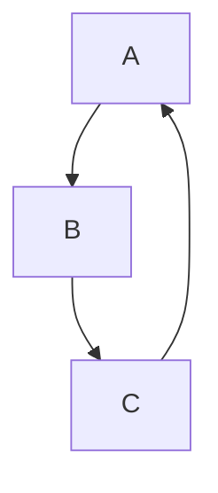
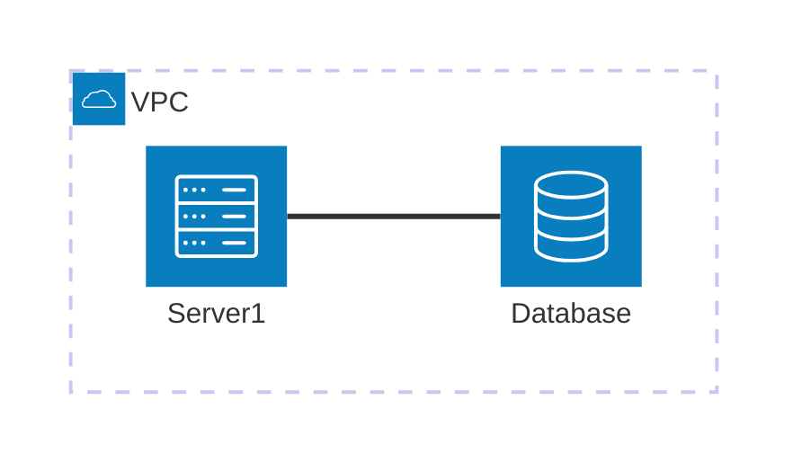

# Mark
Down
**File**


*what are you doing!*

```
If you know discord you'll know this one
```
> ig this ones also works
 
 

 [It's the Drifter](https://deadlock.wiki/Drifter)

 [Md Cheatsheet](https://docs.github.com/en/get-started/writing-on-github/getting-started-with-writing-and-formatting-on-github/basic-writing-and-formatting-syntax)




